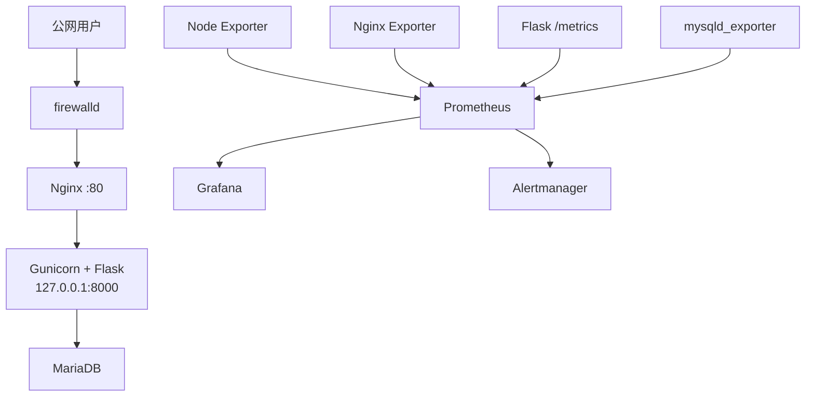
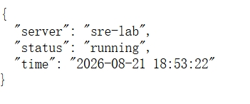
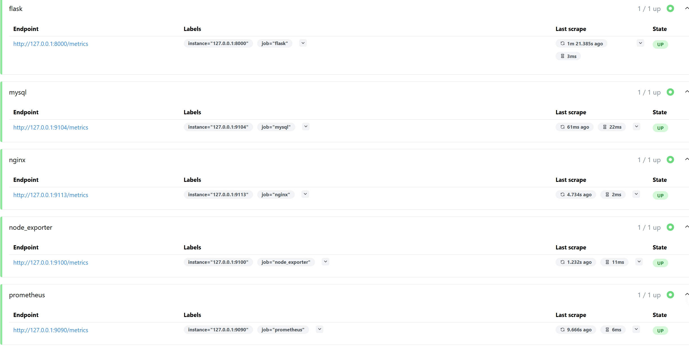
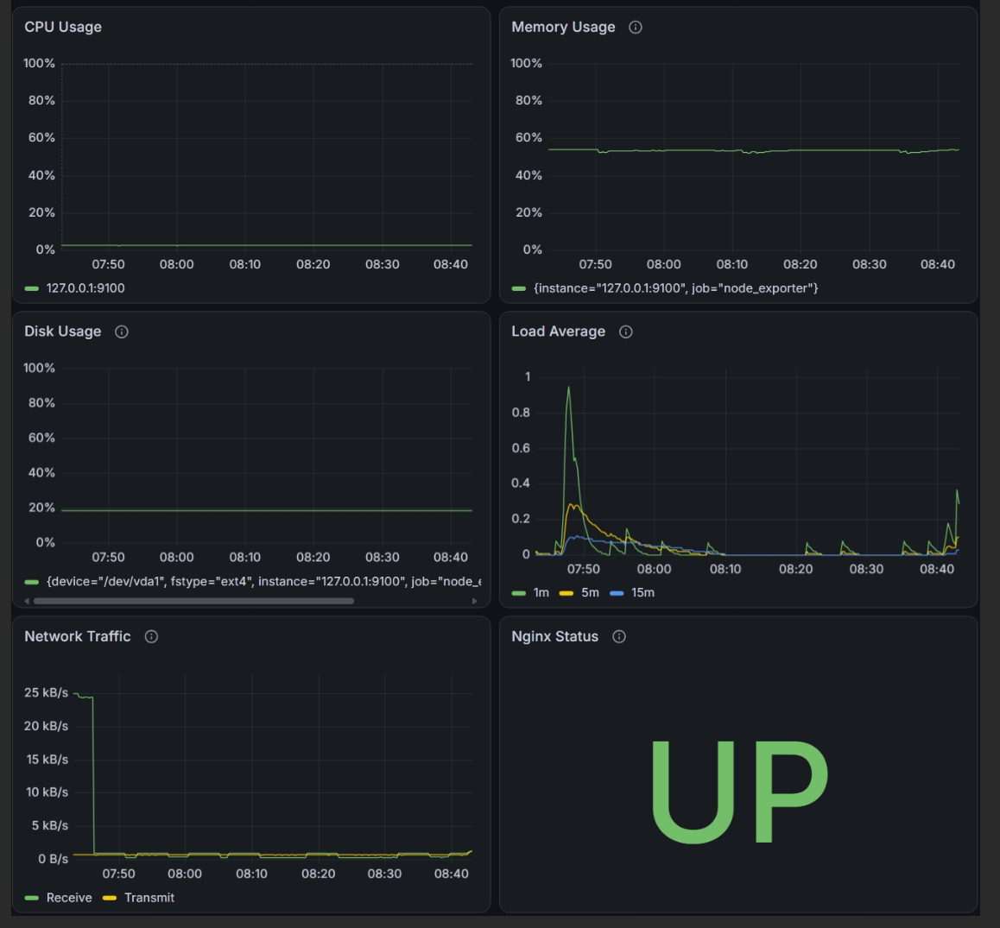

# SRE Lab

基于腾讯云 Rocky Linux 搭建的小型 SRE 实战环境，覆盖 Web 服务部署、数据库持久化、备份恢复、指标监控、可视化和告警验证。

项目不是单独安装一组软件，而是围绕一套真实服务逐步建立以下能力：

> 可运行 → 可管理 → 可持久化 → 可恢复 → 可观测 → 可告警

## 项目架构



监控组件优先绑定 `127.0.0.1`。Grafana 通过 SSH Tunnel 访问，应用的 8000 端口和各 Exporter 端口均不直接暴露公网。

## 技术栈

| 分类 | 技术 |
| --- | --- |
| 云平台与系统 | Tencent Cloud CVM、Rocky Linux 9 |
| Web 与应用 | Nginx、Python、Flask、Gunicorn |
| 数据库 | MariaDB、PyMySQL |
| 服务管理 | systemd、systemd timer |
| 备份 | Shell、mysqldump |
| 指标采集 | Prometheus、Node Exporter、Nginx Exporter、mysqld_exporter、prometheus_client |
| 可视化与告警 | Grafana、Alertmanager |
| 版本管理 | Git、GitHub |

## V1.0 已实现功能

### Web 服务部署

- 完成 Rocky Linux 服务器初始化、普通用户及 sudo 权限配置。
- 使用 firewalld 仅开放必要的 SSH 和 HTTP 服务。
- 使用 Nginx 作为公网入口和反向代理。
- 使用 Gunicorn 运行 Flask 应用，并交由 systemd 管理。
- 后端应用仅监听 `127.0.0.1:8000`，不直接暴露公网。

### 数据持久化与安全

- 使用 MariaDB 保存服务器信息。
- 实现服务器信息的查询、新增、修改和删除接口。
- 为应用和监控分别创建最小权限数据库账户。
- 将数据库密码移出代码，通过 `/etc/sre-app.env` 和 systemd `EnvironmentFile` 注入。

主要接口：

| Method | Endpoint | 功能 |
| --- | --- | --- |
| GET | `/api/status` | 查看应用状态 |
| GET | `/api/servers` | 查询服务器信息 |
| POST | `/api/servers` | 新增服务器信息 |
| PUT | `/api/servers/<id>` | 更新服务器信息 |
| DELETE | `/api/servers/<id>` | 删除服务器信息 |
| GET | `/metrics` | 暴露应用监控指标 |

### 备份与恢复

- 使用 `mysqldump` 完成 MariaDB 手工备份。
- 通过删除测试数据并执行恢复，验证备份文件真实可用。
- 编写 Shell 脚本，实现时间戳命名、日志记录、失败清理和旧备份轮转。
- 使用 systemd timer 每日 `02:00` 自动执行备份，启用 `Persistent=true` 避免错过任务。

### 监控与可视化

Prometheus 每 15 秒采集一次指标，当前监控对象如下：

| Target | 监控内容 | 关键指标示例 |
| --- | --- | --- |
| Prometheus | 监控系统自身 | `up` |
| Node Exporter | CPU、内存、磁盘、网络、负载 | `node_*` |
| Nginx Exporter | 存活、请求量、连接状态 | `nginx_up`、`nginx_http_requests_total` |
| Flask `/metrics` | 请求量、状态码、延迟 | `flask_http_requests_total`、`flask_http_request_duration_seconds` |
| mysqld_exporter | 数据库连接、查询及线程 | `mysql_up`、`mysql_global_status_queries` |

Grafana Dashboard 已覆盖：

- Linux：CPU、内存、磁盘、Load Average、网络流量。
- Nginx：服务状态、请求速率、活跃连接、连接状态。
- Flask：服务状态、请求速率、请求延迟。
- MariaDB：服务状态、连接数、QPS、运行线程数。

### Alertmanager 告警闭环

已配置第一条 Prometheus 告警规则：

```yaml
- alert: InstanceDown
  expr: up == 0
  for: 1m
  labels:
    severity: critical
  annotations:
    description: "{{ $labels.job }} target {{ $labels.instance }} has been down for more than 1 minute"
```

该规则表示：任一监控 Target 持续不可用 1 分钟后，触发 `critical` 级别告警。

## 故障注入验证

为验证告警链路，手动停止 Nginx Exporter：

```bash
sudo systemctl stop nginx-exporter
```

验证结果：

```text
停止 nginx-exporter
        ↓
Prometheus 检测到 up{job="nginx"} = 0
        ↓
告警状态由 inactive 进入 pending
        ↓
持续 1 分钟后进入 firing
        ↓
Alertmanager 收到 InstanceDown
        ↓
重新启动 nginx-exporter
        ↓
up 恢复为 1，告警自动 resolved
```

本次演练确认了以下链路能够正常工作：

> 故障注入 → 指标异常 → 规则计算 → 告警触发 → Alertmanager 接收 → 服务恢复 → 告警解除

## 典型问题与排查

| 问题 | 排查方式 | 原因与处理 |
| --- | --- | --- |
| Nginx `server_name` 冲突 | `nginx -T` | 定位重复的默认 Server 配置并调整 |
| Flask 8000 端口冲突 | `ss -tnlp`、`journalctl -u sre-app` | 停止已有进程，统一交由 systemd 管理 |
| Gunicorn Worker 启动失败 | `journalctl`、手工导入模块 | 定位 Python import 拼写错误 |
| Flask API 返回 500 | `journalctl -u sre-app` | 修复 `DictCursor` 拼写和 SQL 参数问题 |
| POST 请求返回 405 | 检查 `app.url_map` | 补充路由允许的 HTTP Method |
| Grafana 仓库 GPG 校验失败 | 检查仓库与 GPG Key | 改用 Standalone RPM 安装 |
| GitHub Release 下载超时 | 检查服务器下载链路 | 本地下载后通过 SFTP/SCP 上传 |
| Exporter 报 `217/USER` | `systemctl status`、`id` | 修正 systemd 中不一致的运行用户名 |

## 项目成果

- [x] Linux 云服务器初始化与基础安全配置
- [x] Nginx 反向代理
- [x] Flask + Gunicorn 应用部署
- [x] systemd 服务化与开机自启动
- [x] MariaDB 数据持久化与 CRUD API
- [x] 敏感配置与代码分离
- [x] 数据库自动备份与恢复验证
- [x] Linux、Nginx、Flask、MariaDB 指标采集
- [x] Grafana Dashboard
- [x] Prometheus 告警规则
- [x] Alertmanager 告警接收
- [x] 故障注入及告警恢复验证

## 项目截图

### 应用状态接口

通过公网访问 `/api/status`，验证 Nginx、Gunicorn 和 Flask 请求链路正常。



### Prometheus Targets

Prometheus 当前采集 Flask、MariaDB、Nginx、Node Exporter 和自身指标，所有 Target 均为 `UP`。



### Grafana Dashboard

Grafana Dashboard 展示 CPU、内存、磁盘、系统负载、网络流量及 Nginx 服务状态。



## V1.0 边界

V1.0 已完成从部署、管理、持久化、备份到监控告警的基础闭环。目前 Alertmanager 已能接收和管理告警，但尚未接入邮件、企业微信等外部通知渠道；该部分不影响本版本对告警链路的验证。

## 后续规划

- 增加 CPU、内存、磁盘等资源告警规则。
- 接入真实告警通知渠道。
- 补充 Nginx、Flask、MariaDB 服务故障演练。
- 完善日志采集与检索体系。
- 将应用及依赖 Docker 化。
- 通过 CI/CD 实现自动测试和部署。

## 项目文档

## 项目文档

- [服务器初始化](docs/01-server-init.md)
- [Nginx 部署](docs/02-nginx-deploy.md)
- [Flask 应用部署](docs/03-python-service.md)
- [Gunicorn 生产化部署](docs/04-gunicorn-deploy.md)
- [MariaDB 备份与恢复](docs/05-mysql-backup.md)
- [Prometheus 与 Grafana 监控](docs/06-monitoring.md)
- [Alertmanager 告警与故障演练](docs/07-alertmanager.md)
- [故障排查记录](docs/troubleshooting.md)