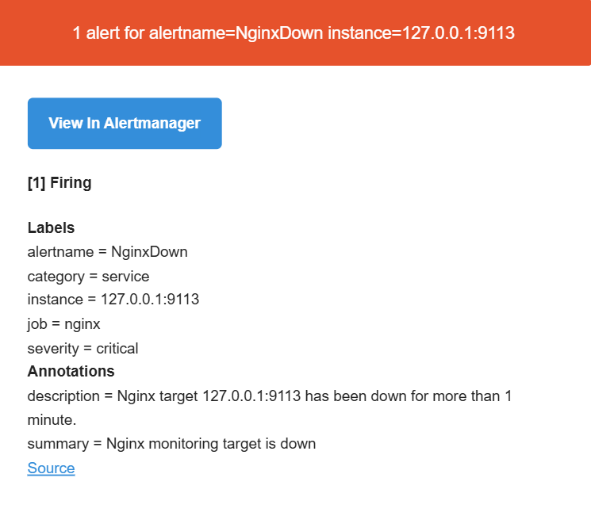
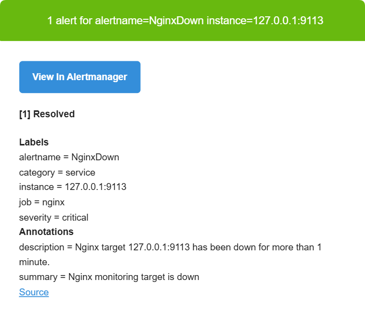
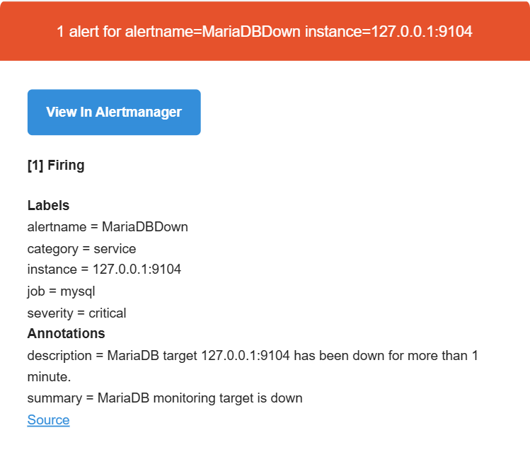

# V1.1 增强告警体系

## 1. 阶段目标

SRE Lab V1.0 已完成 Prometheus、Grafana 和 Alertmanager 的基础告警链路。

V1.1 在此基础上进一步增加：

- 主机资源告警
- 服务存活告警
- 数据库连接率告警
- 告警严重程度分类
- 告警持续时间控制
- 真实邮件通知
- Firing 与 Resolved 通知验证

最终链路：

```text
系统或服务异常
        ↓
Exporter / Application Metrics
        ↓
Prometheus 告警规则
        ↓
Alertmanager
        ↓
QQ SMTP
        ↓
Outlook 收件邮箱
```

---

## 2. 告警规则

V1.1 共配置 8 条告警规则。

### 2.1 主机资源告警

| 告警名称 | 触发条件 | 持续时间 | 级别 |
| --- | --- | --- | --- |
| HighCPUUsage | CPU 使用率 > 80% | 5 分钟 | warning |
| HighMemoryUsage | 内存使用率 > 80% | 5 分钟 | warning |
| HighDiskUsage | 根分区使用率 > 90% | 5 分钟 | critical |

CPU 使用率：

```promql
100 - (
  avg by(instance) (
    rate(node_cpu_seconds_total{mode="idle"}[5m])
  ) * 100
)
```

内存使用率：

```promql
100 * (
  1 - (
    node_memory_MemAvailable_bytes
    /
    node_memory_MemTotal_bytes
  )
)
```

根文件系统使用率：

```promql
100 * (
  1 -
  (
    node_filesystem_avail_bytes{
      mountpoint="/",
      fstype!~"tmpfs|overlay"
    }
    /
    node_filesystem_size_bytes{
      mountpoint="/",
      fstype!~"tmpfs|overlay"
    }
  )
)
```

通过 `for: 5m` 要求资源指标持续异常后再触发告警，避免短暂峰值造成误报。

### 2.2 服务存活告警

| 告警名称 | 检测对象 | 持续时间 | 级别 |
| --- | --- | --- | --- |
| NodeExporterDown | Node Exporter | 1 分钟 | critical |
| NginxDown | Nginx 服务 | 1 分钟 | critical |
| FlaskDown | Flask 应用 | 1 分钟 | critical |
| MariaDBDown | MariaDB 服务 | 1 分钟 | critical |

其中：

```promql
up{job="node_exporter"} == 0
```

检测 Prometheus 是否能够抓取 Node Exporter。

```promql
nginx_up == 0
```

检测 Nginx Exporter 是否能够访问真实 Nginx 服务。

```promql
up{job="flask"} == 0
```

检测 Prometheus 是否能够直接抓取 Flask `/metrics`。

```promql
mysql_up == 0
```

检测 mysqld_exporter 是否能够连接真实 MariaDB 服务。

需要注意：

> Prometheus 的 `up` 表示 Target 是否可以被抓取，不一定等同于 Target 后面的真实服务存活。

### 2.3 数据库连接率告警

告警名称：

```text
MariaDBHighConnectionUsage
```

表达式：

```promql
100 *
mysql_global_status_threads_connected
/
mysql_global_variables_max_connections
> 80
```

计算模型：

```text
数据库连接使用率
= 当前连接数 / 最大连接数 × 100%
```

测试时当前连接使用率约为 1.32%，告警状态为 `inactive`。

---

## 3. 规则验证与部署

新规则先在本地 Git 功能分支编写，再上传到服务器临时目录：

```text
/home/sre/alerts-v1.1.yml
```

使用 `promtool` 验证：

```bash
promtool check rules /home/sre/alerts-v1.1.yml
```

验证结果：

```text
SUCCESS: 8 rules found
```

之后备份原规则并替换正式文件：

```text
/etc/prometheus/rules/alerts.yml
```

完整配置检查：

```bash
promtool check config /etc/prometheus/prometheus.yml
```

通过后重启 Prometheus，并使用 API 确认规则全部加载。

---

## 4. FlaskDown 故障演练

### 4.1 故障注入

停止 Flask 应用：

```bash
sudo systemctl stop sre-app
```

此时 Nginx 访问后端返回：

```text
502 Bad Gateway
```

Prometheus 检测：

```promql
up{job="flask"} == 0
```

告警状态变化：

```text
inactive
→ pending
→ firing
```

Alertmanager 收到：

```text
alertname = FlaskDown
instance = 127.0.0.1:8000
severity = critical
status = active
```

### 4.2 服务恢复

恢复 Flask：

```bash
sudo systemctl start sre-app
```

验证：

```bash
systemctl is-active sre-app
curl -s http://127.0.0.1:8000/api/status
curl -s http://127.0.0.1/api/status
```

最终：

```text
Prometheus state = inactive
active alerts = 0
Alertmanager FlaskDown alerts = 0
```

完成了真实服务故障的触发与恢复闭环。

---

## 5. 邮件通知

V1.1 使用 QQ 邮箱 SMTP 发送告警邮件，由 Outlook 邮箱接收。

SMTP 连接：

```text
smtp.qq.com:587
STARTTLS
```

Alertmanager 通过独立文件读取 SMTP 授权码：

```text
/etc/alertmanager/qq-smtp-auth
```

权限：

```text
-rw------- alertmanager alertmanager
```

公开仓库中只保留配置模板，不保存：

- 真实发件邮箱
- 真实收件邮箱
- QQ SMTP 授权码

### 5.1 Firing 通知

通过 Alertmanager API 注入安全测试告警：

```text
EmailNotificationTest
```

Outlook 成功收到：

```text
[SRE Lab] firing: EmailNotificationTest
```


### 5.2 Resolved 通知

将测试告警标记为恢复后：

```text
Active EmailNotificationTest alerts: 0
```

Outlook 成功收到：

```text
[SRE Lab] resolved: EmailNotificationTest
```


---

## 6. NginxDown 故障演练

### 6.1 演练前基线

故障注入前，Nginx 与 Nginx Exporter 均正常运行：

```text
nginx: active
nginx-exporter: active
nginx_up: 1
/api/status: HTTP 200

对应告警规则：

- alert: NginxDown
  expr: nginx_up == 0
  for: 1m
  labels:
    severity: critical
    category: service
```

### 6.2 故障注入与告警触发

停止 Nginx：

```bash
sudo systemctl stop nginx
```

停止后观察到：

```text
nginx: inactive
nginx-exporter: active
127.0.0.1:80: Connection refused
nginx_up: 0
NginxDown: firing
```

虽然 Nginx Exporter 进程仍然运行，但它无法从 Nginx 状态接口获取有效数据，因此 `nginx_up` 变为 `0`。

这也说明，Prometheus 的 `up{job="nginx"}` 主要表示 Prometheus 能否采集 Nginx Exporter，而 `nginx_up` 才能反映 Exporter 背后的 Nginx 服务是否正常。

Alertmanager 成功发送 NginxDown Firing 邮件：



### 6.3 服务恢复与告警解除

恢复 Nginx：

```bash
sudo systemctl start nginx
```

恢复后进行验证：

```bash
systemctl is-active nginx
curl -sS http://127.0.0.1/api/status
curl -s http://127.0.0.1/nginx_status
```

验证结果：

```text
nginx: active
/api/status: HTTP 200
nginx_up: 1
NginxDown: inactive
active alerts: 0
```

Alertmanager 随后发送 NginxDown Resolved 邮件：



本次演练证明，Nginx 服务发生异常后，Prometheus 能通过 `nginx_up` 发现故障，Alertmanager 能发送 Firing 通知；服务恢复后，告警能够自动解除并发送 Resolved 通知。

---

## 7. MariaDB 故障演练

### 7.1 演练前基线

演练前，MariaDB 和 MySQL Exporter 均正常运行：

```text
mariadb: active
mysqld-exporter: active
mysql_up: 1
/api/status: HTTP 200
/api/servers: HTTP 200
```

对应告警规则：

```yaml
- alert: MariaDBDown
  expr: mysql_up == 0
  for: 1m
  labels:
    severity: critical
    category: service
```

### 7.2 故障注入与业务影响

停止 MariaDB：

```bash
sudo systemctl stop mariadb
```

停止后观察到：

```text
mariadb: inactive
mysqld-exporter: active
/api/status: HTTP 200
/api/servers: HTTP 500
mysql_up: 0
MariaDBDown: firing
```

`/api/status` 仍然返回 HTTP 200，说明 Nginx、Gunicorn 和 Flask 进程仍在运行。

但是 `/api/servers` 需要访问数据库，因此返回 HTTP 500。这说明应用进程存活并不代表所有业务功能都正常，数据库等外部依赖也需要单独监控。

虽然 MySQL Exporter 进程仍然处于 active 状态，但 `mysql_up` 已经变为 `0`，准确反映了 MariaDB 服务不可用。

Alertmanager 成功发送 MariaDBDown Firing 邮件：



### 7.3 数据库恢复与告警解除

恢复 MariaDB：

```bash
sudo systemctl start mariadb
```

恢复后进行验证：

```text
mariadb: active
/api/status: HTTP 200
/api/servers: HTTP 200
mysql_up: 1
MariaDBDown: inactive
active alerts: 0
```

Alertmanager 随后发送 MariaDBDown Resolved 邮件：


本次演练证明，MariaDB 故障会影响依赖数据库的业务接口，但不会必然导致 Flask 进程停止。通过同时监控应用健康状态、业务接口和 `mysql_up` 指标，可以更准确地判断故障范围。

---

## 8. V1.1 告警闭环

V1.1 完成的告警处理流程如下：

```text
异常发生
→ Exporter 采集到指标异常
→ Prometheus 告警进入 pending
→ 异常持续超过 for 时间
→ Prometheus 告警进入 firing
→ Alertmanager 接收、分组并路由告警
→ QQ SMTP 发送 Firing 邮件
→ 服务恢复
→ Prometheus 告警恢复为 inactive
→ Alertmanager 清除活动告警
→ QQ SMTP 发送 Resolved 邮件
```

V1.1 已完成 Flask、Nginx 和 MariaDB 的实际故障演练，并将基础告警系统扩展为具备主机资源监控、服务监控、数据库监控和真实邮件通知能力的告警体系。