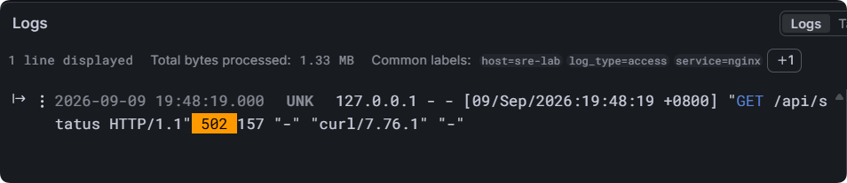
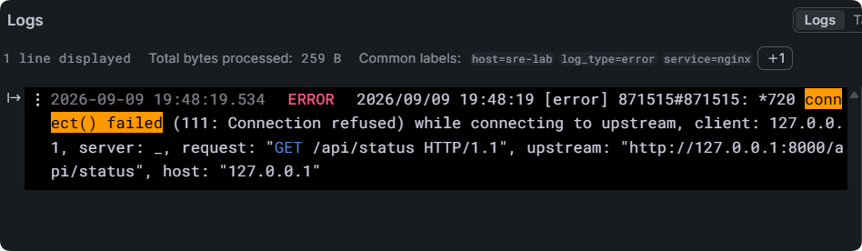
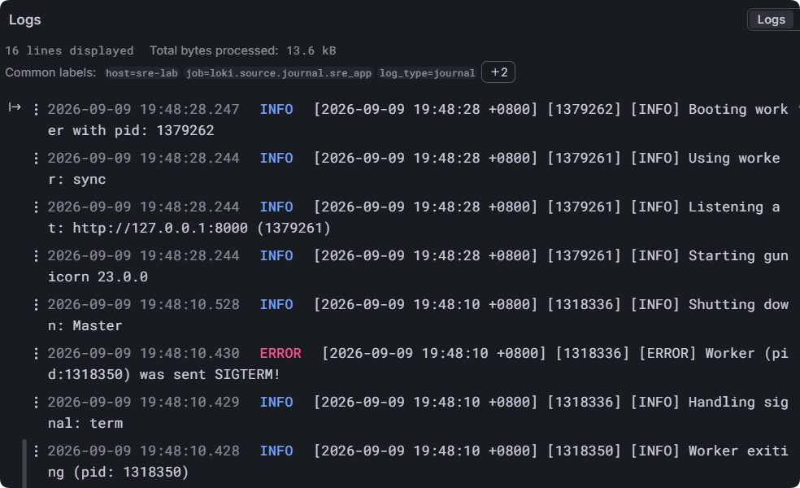

# V1.2 Loki + Grafana Alloy 日志系统

## 1. 阶段目标

V1.1 已完成指标监控、告警通知和服务故障演练。V1.2 在此基础上补充集中日志能力，解决 Nginx 文件日志、Gunicorn 应用日志和 MariaDB 日志分散查询的问题。

本阶段完成：

- 盘点 Nginx、Gunicorn、MariaDB 与 systemd journal 日志。
- 部署单机 Loki 3.7.7，使用本地文件系统保存日志。
- 使用 Grafana Alloy 1.19.2 采集文件日志和 systemd journal。
- 将 Loki、Alloy 管理端口限制在 `127.0.0.1`。
- 在 Grafana Explore 中使用 LogQL 查询日志。
- 修正 Nginx 历史日志采集时间失真问题。
- 完成 Flask 停止、HTTP 502、日志定位、服务恢复演练。

整体链路：

```text
Nginx access/error log ----+
MariaDB error log ---------+
sre-app systemd journal ---+---> Grafana Alloy ---> Loki ---> Grafana Explore
MariaDB systemd journal ---+
```

## 2. 现有日志盘点

| 对象 | 日志位置 | 主要用途 |
| --- | --- | --- |
| Nginx 访问日志 | `/var/log/nginx/access.log` | 请求路径、状态码、客户端 IP、User-Agent |
| Nginx 错误日志 | `/var/log/nginx/error.log` | upstream 连接失败、配置及运行错误 |
| Flask/Gunicorn | `journalctl -u sre-app` | Gunicorn 启停、Worker 状态、Python 异常堆栈 |
| MariaDB 服务 | `journalctl -u mariadb` | 服务启动、停止和 systemd 状态 |
| MariaDB 内部错误 | `/var/log/mariadb/mariadb.log` | 数据库启动、存储引擎及内部错误 |

Nginx 日志由 logrotate 每日轮转，保留 10 份并压缩历史文件。MariaDB 的 `general_log` 和 `slow_query_log` 保持关闭，避免无必要的性能开销和敏感 SQL 记录。

## 3. 组件选型

Promtail 已结束生命周期，因此本项目使用 Grafana Alloy 作为日志采集端。

组件职责：

- Alloy：发现、读取、处理并转发日志。
- Loki：集中存储日志并提供 LogQL 查询接口。
- Grafana：通过 Loki 数据源检索和展示日志。

安装版本：

```text
loki-3.7.7-1.x86_64
alloy-1.19.2-1.x86_64
```

## 4. Loki 单机部署

Loki 使用单机模式和本地文件系统：

```text
HTTP API   127.0.0.1:3100
gRPC       127.0.0.1:9096
数据目录   /var/lib/loki
保留时间   168h（7 天）
```

关键设计：

- `auth_enabled: false`：单机内部使用，不启用多租户认证。
- 仅绑定 `127.0.0.1`，不向公网暴露 Loki API。
- 使用 TSDB、schema v13 和 filesystem 存储。
- Compactor 开启 7 天日志保留策略。
- 关闭匿名使用统计。
- 数据存放在 `/var/lib/loki`，不使用可能被清理的 `/tmp`。

配置文件见：[`../configs/loki/config.yml`](../configs/loki/config.yml)。

验证：

```bash
sudo systemctl is-active loki
curl -s http://127.0.0.1:3100/ready
sudo ss -lntp | grep -E ':(3100|9096)\b'
```

## 5. Alloy 日志采集

Alloy 采集以下日志：

- Nginx access log 和 error log。
- MariaDB error log。
- `sre-app.service` journal。
- `mariadb.service` journal。

文件日志通过 `local.file_match` 和 `loki.source.file` 读取，systemd 日志通过 `loki.source.journal` 读取，最后由 `loki.write` 发送至：

```text
http://127.0.0.1:3100/loki/api/v1/push
```

Alloy 使用独立系统用户运行。通过 ACL 仅授予其读取 Nginx、MariaDB 日志的权限，并加入 `systemd-journal` 组读取 journal，未授予 root 权限。

管理界面监听：

```text
127.0.0.1:12345
```

配置文件见：

- [`../configs/alloy/config.alloy`](../configs/alloy/config.alloy)
- [`../configs/alloy/alloy.sysconfig`](../configs/alloy/alloy.sysconfig)

## 6. Nginx 时间戳修正

Alloy 第一次读取已有 `access.log` 时，如果不解析日志内的时间，Loki 会使用采集时间作为日志时间。测试中发现上午产生的旧日志集中显示在 Alloy 17:37 启动时刻，导致 4xx 趋势图出现不真实尖峰。

处理方式：

```text
Nginx 原始日志
  -> stage.regex 提取方括号内 timestamp
  -> stage.timestamp 按 Nginx 格式解析
  -> Loki 使用真实事件时间
```

时间格式：

```text
02/Jan/2006:15:04:05 -0700
```

修正后验证：

```text
Grafana 时间：2026-09-09 19:41:44
日志时间：   09/Sep/2026:19:41:44 +0800
```

两者一致，说明时间解析生效。历史错误时间数据不手工删除，由 Loki 7 天保留策略自然淘汰。

## 7. Grafana 与 LogQL

Grafana 添加 Loki 数据源：

```text
URL: http://127.0.0.1:3100
```

常用查询：

```logql
{service="nginx"}
```

```logql
{service="nginx", log_type="access"} |= " 502 "
```

```logql
{service="nginx", log_type="error"} |= "connect() failed"
```

```logql
{service="nginx", log_type="access"} != "/nginx_status" |~ " (400|401|403|404) "
```

```logql
{service="sre-app"}
```

统计每 5 分钟的 4xx 日志数量：

```logql
sum(
  count_over_time(
    {service="nginx", log_type="access"}
      != "/nginx_status"
      |~ " (400|401|403|404) " [5m]
  )
)
```

公网 Nginx 日志中可观察到 `/HNAP1/`、`/configurations`、`/iam/login` 等自动扫描请求，服务器返回 400 或 404。该现象用于验证异常访问检索能力，不能仅凭扫描请求判断服务器已被入侵。

## 8. Flask 502 日志故障演练

故障前状态：

```text
sre-app、nginx、loki、alloy 均为 active
/api/status 返回 HTTP 200
```

停止应用：

```bash
sudo systemctl stop sre-app
```

访问接口后得到：

```text
During drill: HTTP 502
```

日志证据：

1. Nginx access log 记录 `/api/status` 返回 502。
2. Nginx error log 记录 `connect() failed (111: Connection refused) while connecting to upstream`。
3. `sre-app` journal 记录 Gunicorn Worker 退出和 Master 关闭。

### 演练截图

Nginx access log 记录接口返回 HTTP 502：



Nginx error log 定位 upstream 连接被拒绝：



`sre-app` journal 记录 Gunicorn 停止与恢复：



恢复：

```bash
sudo systemctl start sre-app
sudo systemctl is-active sre-app
curl -s -o /dev/null -w 'HTTP %{http_code}\n' http://127.0.0.1/api/status
```

恢复后服务为 `active`，接口重新返回 HTTP 200，Gunicorn journal 记录重新监听 `127.0.0.1:8000` 和 Worker 启动。

故障定位闭环：

```text
HTTP 502
  -> access log 确认失败时间和路径
  -> error log 定位 upstream 连接被拒绝
  -> sre-app journal 确认 Gunicorn 已停止
  -> 启动 sre-app
  -> HTTP 200 验证恢复
```

## 9. 安全与资源控制

- Loki 3100、9096 和 Alloy 12345 均仅监听 `127.0.0.1`。
- Grafana 通过服务器本机地址访问 Loki。
- Alloy 采用最小日志读取权限，不使用 root 运行。
- Loki 日志保留 7 天，避免磁盘无限增长。
- MariaDB general log 保持关闭，避免记录全部 SQL。
- Loki 与 Alloy 的匿名使用统计均已关闭。
- 导出配置经过关键词检查，未发现密码、Token 或授权信息。

初始数据占用：

```text
/var/lib/loki   396K
/var/lib/alloy   72K
```

## 10. 阶段成果

- [x] 完成现有日志盘点。
- [x] 部署 Loki 和 Grafana Alloy。
- [x] 文件日志与 systemd journal 集中采集。
- [x] Grafana Loki 数据源接入。
- [x] LogQL 路径、状态码和服务日志查询。
- [x] Nginx 日志真实时间解析。
- [x] Flask 502 日志故障排查与恢复验证。
- [x] Loki、Alloy 配置脱敏导出。

V1.2 建立了以下日志闭环：

> 产生日志 -> 集中采集 -> Loki 存储 -> LogQL 检索 -> 故障定位 -> 服务恢复 -> 业务验证
